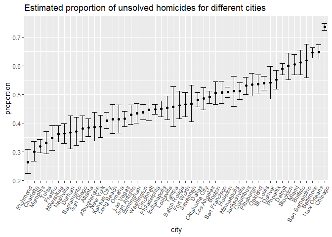
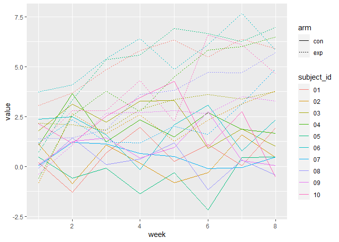
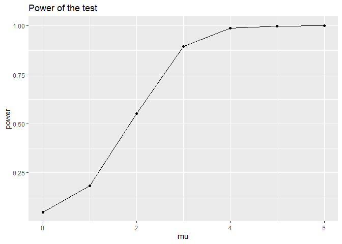
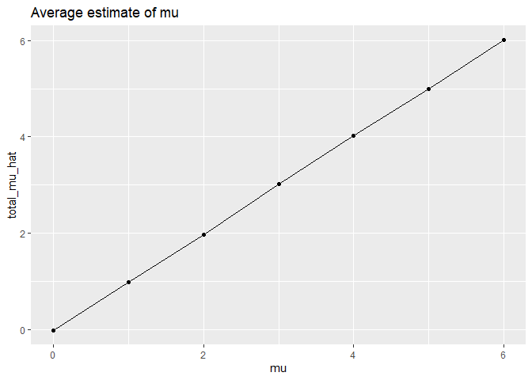
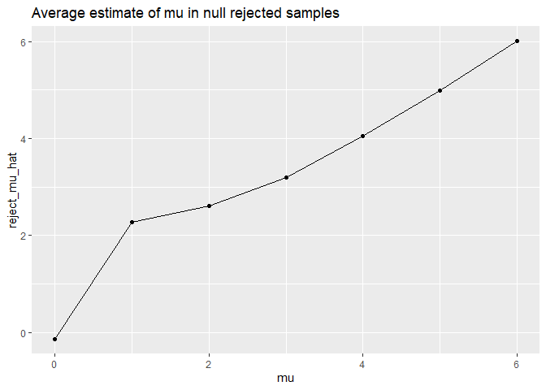

p8105_hw5_zl3386
================
Ziqiu Liu
2023-11-08

``` r
library(tidyverse)
library(rvest)
library(readr)
```

## Problem 1

``` r
homicide_df = 
  read_csv("data/homicide-data.csv") |>
  mutate(
    victim_age = as.numeric(victim_age))
```

    ## Rows: 52179 Columns: 12
    ## ── Column specification ────────────────────────────────────────────────────────
    ## Delimiter: ","
    ## chr (9): uid, victim_last, victim_first, victim_race, victim_age, victim_sex...
    ## dbl (3): reported_date, lat, lon
    ## 
    ## ℹ Use `spec()` to retrieve the full column specification for this data.
    ## ℹ Specify the column types or set `show_col_types = FALSE` to quiet this message.

    ## Warning: There was 1 warning in `mutate()`.
    ## ℹ In argument: `victim_age = as.numeric(victim_age)`.
    ## Caused by warning:
    ## ! NAs introduced by coercion

- The raw data has 52179 rows and 12 columns. Each row represents a
  homicide record (identified by a `uid`), with information about the
  location of the killing (`city`, `state`, `lat` and `lon`), whether an
  arrest was made (`disposition`), and basic demographic information
  about the victim (last and first name, race, age and sex).

Create a `city_state` variable.

``` r
homicide_df = homicide_df |>
  mutate(
    city_state = paste(city, ",", state)
  )
```

summarize within cities to obtain the total number of homicides and the
number of unsolved homicides.

``` r
homicide_df |>
  group_by(city) |>
  summarize(
    total_homicide = n(),
    unsolved_homicide = sum(disposition %in% c("Closed without arrest", "Open/No arrest"))
  )
```

    ## # A tibble: 50 × 3
    ##    city        total_homicide unsolved_homicide
    ##    <chr>                <int>             <int>
    ##  1 Albuquerque            378               146
    ##  2 Atlanta                973               373
    ##  3 Baltimore             2827              1825
    ##  4 Baton Rouge            424               196
    ##  5 Birmingham             800               347
    ##  6 Boston                 614               310
    ##  7 Buffalo                521               319
    ##  8 Charlotte              687               206
    ##  9 Chicago               5535              4073
    ## 10 Cincinnati             694               309
    ## # ℹ 40 more rows

For the city of Baltimore, MD, use the `prop.test` function to estimate
the proportion of homicides that are unsolved; save the output of
`prop.test` as an R object, apply the `broom::tidy` to this object and
pull the estimated proportion and confidence intervals from the
resulting tidy dataframe.

``` r
unsolved = homicide_df |>
  group_by(city) |>
  summarize(
    total_homicide = n(),
    unsolved_homicide = sum(disposition %in% c("Closed without arrest", "Open/No arrest"))
  ) |>
  filter(city == "Baltimore") |>
  select(unsolved_homicide, total_homicide) 

Baltimore_prop = prop.test(x = pull(unsolved, unsolved_homicide), n = pull(unsolved, total_homicide)) |>
  broom::tidy() |>
  select(estimate, conf.low, conf.high)
```

- The estimated proportion is 0.646, and its 95% confidence interval is
  \[0.628, 0.663\].

Run `prop.test` for each of the cities in the dataset, and extract both
the proportion of unsolved homicides and the confidence interval for
each.

``` r
tb_prop_test = function(tb, alpha = 0.95) {
  prop.test(x = sum(tb), n = nrow(tb), conf.level = alpha)
}

unsolved_df = homicide_df |>
  mutate(
    unsolved = case_match(
      disposition,
      c("Closed without arrest", "Open/No arrest") ~ 1,
      "Closed by arrest" ~ 0
    )
  ) |>
  select(city, unsolved) |>
  nest(unsolved_status = -city) |>
  mutate(
    test = map(unsolved_status, tb_prop_test),
    results = map(test, broom::tidy)
  ) |>
  select(city, results) |>
  unnest(results) |>
  select(city, estimate, conf.low, conf.high)
```

Create a plot that shows the estimates and CIs for each city.

``` r
unsolved_df |>
  mutate(city = fct_reorder(city, estimate)) |> 
  ggplot(aes(x = city, y = estimate)) +
  geom_point() +
  geom_errorbar(aes(ymin = conf.low, ymax = conf.high)) +
  labs(title = "Estimated proportion of unsolved homicides for different cities", y = "proportion") +
  theme(axis.text.x = element_text(angle = 60, hjust = 1)) 
```

<!-- -->

## Problem 2

``` r
# dataframe containing all file names
file_name = list.files("data/study_data")

# read in data for each subject
read_data = function(file) {
  read_csv(str_c("data/study_data/", file))
}

study_df = data.frame(file_name) |>
  mutate(
    data = map(file_name, read_data)
  )
```

    ## Rows: 1 Columns: 8
    ## ── Column specification ────────────────────────────────────────────────────────
    ## Delimiter: ","
    ## dbl (8): week_1, week_2, week_3, week_4, week_5, week_6, week_7, week_8
    ## 
    ## ℹ Use `spec()` to retrieve the full column specification for this data.
    ## ℹ Specify the column types or set `show_col_types = FALSE` to quiet this message.
    ## Rows: 1 Columns: 8
    ## ── Column specification ────────────────────────────────────────────────────────
    ## Delimiter: ","
    ## dbl (8): week_1, week_2, week_3, week_4, week_5, week_6, week_7, week_8
    ## 
    ## ℹ Use `spec()` to retrieve the full column specification for this data.
    ## ℹ Specify the column types or set `show_col_types = FALSE` to quiet this message.
    ## Rows: 1 Columns: 8
    ## ── Column specification ────────────────────────────────────────────────────────
    ## Delimiter: ","
    ## dbl (8): week_1, week_2, week_3, week_4, week_5, week_6, week_7, week_8
    ## 
    ## ℹ Use `spec()` to retrieve the full column specification for this data.
    ## ℹ Specify the column types or set `show_col_types = FALSE` to quiet this message.
    ## Rows: 1 Columns: 8
    ## ── Column specification ────────────────────────────────────────────────────────
    ## Delimiter: ","
    ## dbl (8): week_1, week_2, week_3, week_4, week_5, week_6, week_7, week_8
    ## 
    ## ℹ Use `spec()` to retrieve the full column specification for this data.
    ## ℹ Specify the column types or set `show_col_types = FALSE` to quiet this message.
    ## Rows: 1 Columns: 8
    ## ── Column specification ────────────────────────────────────────────────────────
    ## Delimiter: ","
    ## dbl (8): week_1, week_2, week_3, week_4, week_5, week_6, week_7, week_8
    ## 
    ## ℹ Use `spec()` to retrieve the full column specification for this data.
    ## ℹ Specify the column types or set `show_col_types = FALSE` to quiet this message.
    ## Rows: 1 Columns: 8
    ## ── Column specification ────────────────────────────────────────────────────────
    ## Delimiter: ","
    ## dbl (8): week_1, week_2, week_3, week_4, week_5, week_6, week_7, week_8
    ## 
    ## ℹ Use `spec()` to retrieve the full column specification for this data.
    ## ℹ Specify the column types or set `show_col_types = FALSE` to quiet this message.
    ## Rows: 1 Columns: 8
    ## ── Column specification ────────────────────────────────────────────────────────
    ## Delimiter: ","
    ## dbl (8): week_1, week_2, week_3, week_4, week_5, week_6, week_7, week_8
    ## 
    ## ℹ Use `spec()` to retrieve the full column specification for this data.
    ## ℹ Specify the column types or set `show_col_types = FALSE` to quiet this message.
    ## Rows: 1 Columns: 8
    ## ── Column specification ────────────────────────────────────────────────────────
    ## Delimiter: ","
    ## dbl (8): week_1, week_2, week_3, week_4, week_5, week_6, week_7, week_8
    ## 
    ## ℹ Use `spec()` to retrieve the full column specification for this data.
    ## ℹ Specify the column types or set `show_col_types = FALSE` to quiet this message.
    ## Rows: 1 Columns: 8
    ## ── Column specification ────────────────────────────────────────────────────────
    ## Delimiter: ","
    ## dbl (8): week_1, week_2, week_3, week_4, week_5, week_6, week_7, week_8
    ## 
    ## ℹ Use `spec()` to retrieve the full column specification for this data.
    ## ℹ Specify the column types or set `show_col_types = FALSE` to quiet this message.
    ## Rows: 1 Columns: 8
    ## ── Column specification ────────────────────────────────────────────────────────
    ## Delimiter: ","
    ## dbl (8): week_1, week_2, week_3, week_4, week_5, week_6, week_7, week_8
    ## 
    ## ℹ Use `spec()` to retrieve the full column specification for this data.
    ## ℹ Specify the column types or set `show_col_types = FALSE` to quiet this message.
    ## Rows: 1 Columns: 8
    ## ── Column specification ────────────────────────────────────────────────────────
    ## Delimiter: ","
    ## dbl (8): week_1, week_2, week_3, week_4, week_5, week_6, week_7, week_8
    ## 
    ## ℹ Use `spec()` to retrieve the full column specification for this data.
    ## ℹ Specify the column types or set `show_col_types = FALSE` to quiet this message.
    ## Rows: 1 Columns: 8
    ## ── Column specification ────────────────────────────────────────────────────────
    ## Delimiter: ","
    ## dbl (8): week_1, week_2, week_3, week_4, week_5, week_6, week_7, week_8
    ## 
    ## ℹ Use `spec()` to retrieve the full column specification for this data.
    ## ℹ Specify the column types or set `show_col_types = FALSE` to quiet this message.
    ## Rows: 1 Columns: 8
    ## ── Column specification ────────────────────────────────────────────────────────
    ## Delimiter: ","
    ## dbl (8): week_1, week_2, week_3, week_4, week_5, week_6, week_7, week_8
    ## 
    ## ℹ Use `spec()` to retrieve the full column specification for this data.
    ## ℹ Specify the column types or set `show_col_types = FALSE` to quiet this message.
    ## Rows: 1 Columns: 8
    ## ── Column specification ────────────────────────────────────────────────────────
    ## Delimiter: ","
    ## dbl (8): week_1, week_2, week_3, week_4, week_5, week_6, week_7, week_8
    ## 
    ## ℹ Use `spec()` to retrieve the full column specification for this data.
    ## ℹ Specify the column types or set `show_col_types = FALSE` to quiet this message.
    ## Rows: 1 Columns: 8
    ## ── Column specification ────────────────────────────────────────────────────────
    ## Delimiter: ","
    ## dbl (8): week_1, week_2, week_3, week_4, week_5, week_6, week_7, week_8
    ## 
    ## ℹ Use `spec()` to retrieve the full column specification for this data.
    ## ℹ Specify the column types or set `show_col_types = FALSE` to quiet this message.
    ## Rows: 1 Columns: 8
    ## ── Column specification ────────────────────────────────────────────────────────
    ## Delimiter: ","
    ## dbl (8): week_1, week_2, week_3, week_4, week_5, week_6, week_7, week_8
    ## 
    ## ℹ Use `spec()` to retrieve the full column specification for this data.
    ## ℹ Specify the column types or set `show_col_types = FALSE` to quiet this message.
    ## Rows: 1 Columns: 8
    ## ── Column specification ────────────────────────────────────────────────────────
    ## Delimiter: ","
    ## dbl (8): week_1, week_2, week_3, week_4, week_5, week_6, week_7, week_8
    ## 
    ## ℹ Use `spec()` to retrieve the full column specification for this data.
    ## ℹ Specify the column types or set `show_col_types = FALSE` to quiet this message.
    ## Rows: 1 Columns: 8
    ## ── Column specification ────────────────────────────────────────────────────────
    ## Delimiter: ","
    ## dbl (8): week_1, week_2, week_3, week_4, week_5, week_6, week_7, week_8
    ## 
    ## ℹ Use `spec()` to retrieve the full column specification for this data.
    ## ℹ Specify the column types or set `show_col_types = FALSE` to quiet this message.
    ## Rows: 1 Columns: 8
    ## ── Column specification ────────────────────────────────────────────────────────
    ## Delimiter: ","
    ## dbl (8): week_1, week_2, week_3, week_4, week_5, week_6, week_7, week_8
    ## 
    ## ℹ Use `spec()` to retrieve the full column specification for this data.
    ## ℹ Specify the column types or set `show_col_types = FALSE` to quiet this message.
    ## Rows: 1 Columns: 8
    ## ── Column specification ────────────────────────────────────────────────────────
    ## Delimiter: ","
    ## dbl (8): week_1, week_2, week_3, week_4, week_5, week_6, week_7, week_8
    ## 
    ## ℹ Use `spec()` to retrieve the full column specification for this data.
    ## ℹ Specify the column types or set `show_col_types = FALSE` to quiet this message.

``` r
# tidy the result
study_df = study_df |>
  mutate(
    arm = substr(file_name, 1, 3),
    subject_id = substr(file_name, 5, 6)
  ) |>
  select(subject_id, arm, data) |>
  unnest(data) |>
  pivot_longer(
    week_1:week_8,
    names_to = "week",
    values_to = "value"
  ) |>
  mutate(week = parse_number(week))
```

Make a spaghetti plot showing observations on each subject over time.

``` r
study_df |> 
  ggplot(aes(x = week, y = value, group = interaction(subject_id, arm), color = subject_id, lty = arm)) +
  geom_line()
```

<!-- -->

- From the spaghetti plot, we can see that in this longitudinal study,
  the experimental arm has a significant higher value than the control
  arm in general.

- Also, the value in the experimental arm tends to increase over time,
  while the value in the control arm remains relatively stable.

## Problem 3

``` r
n = 30
sigma = 5
reps = 5000

# store the results for each mu value
results = tibble(
  mu = numeric(), 
  power = numeric(), 
  reject_mu_hat = numeric(), 
  total_mu_hat = numeric()
)

# function for generating each dataset and obtain the estimate and p-value
sim_normal_test = function(mu = 0, sigma = 5, n = 30) {
  rnorm(n, mu, sigma) |>
    t.test() |>
    broom::tidy() |>
    select(estimate, p.value)
}

# iteration
for(mu in 0:6) {
  reject_num = 0
  reject_est = c()
  total_est = c()
  
  for(i in 1:reps) {
    test = sim_normal_test(mu = mu)
    total_est = append(total_est, pull(test, estimate))
    
    if(pull(test, p.value) < 0.05) {
      reject_num = reject_num + 1
      reject_est = append(reject_est, pull(test, estimate))
    }
    
  }
  
  power = reject_num / reps
  reject_mu_hat = mean(reject_est)
  total_mu_hat = mean(total_est)
  
  results = results |>
    add_row(
      mu = mu,
      power = power,
      reject_mu_hat = reject_mu_hat,
      total_mu_hat = total_mu_hat
    )
  
}
```

``` r
# power of the test
results |>
  ggplot(aes(x = mu, y = power)) +
  geom_point() +
  geom_line() +
  labs(title = "Power of the test")
```

<!-- -->

``` r
results |>
  ggplot(aes(x = mu, y = total_mu_hat)) +
  geom_point() +
  geom_line() +
  labs(title = "Average estimate of mu")
```

<!-- -->

``` r
results |>
  ggplot(aes(x = mu, y = reject_mu_hat)) +
  geom_point() +
  geom_line() +
  labs(title = "Average estimate of mu in null rejected samples")
```

<!-- -->
